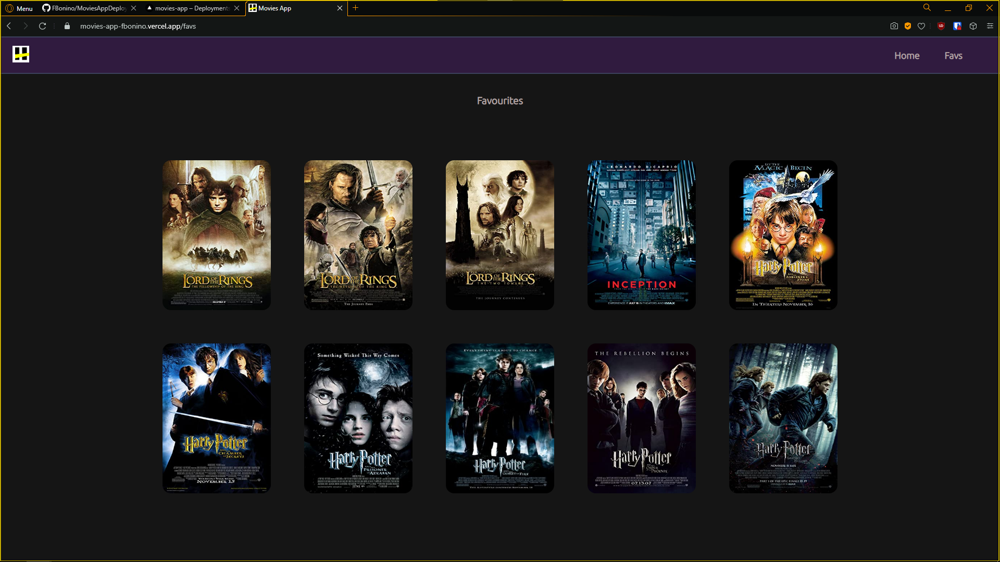
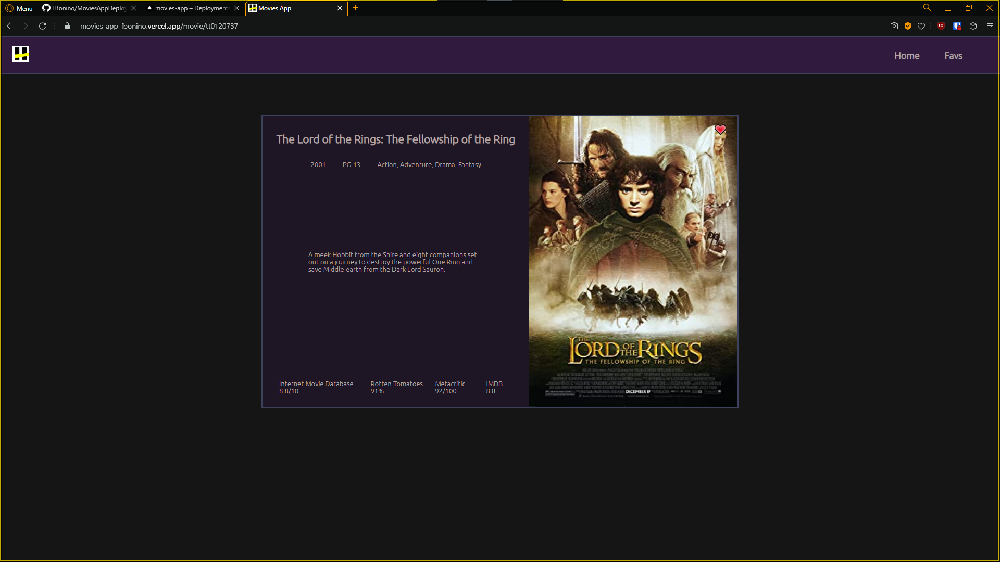
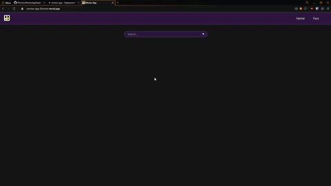
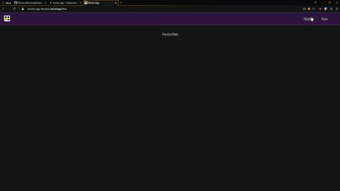

# Movies App

### About

App created during Henry's bootcamp to practice __ReactJS__ and __Redux__ for Frontend Development. Using the [OMDB API](http://www.omdbapi.com/) I created a SPA (single page application) that allows the user to:

* Search for a movie and list similar results.
* See a movie details to get more information about it's plot and rating.
* Access a favourites tab that lists the user's favourite movies.
* Add movies to the favourites list.
* Remove movies from the favourites list.

### Result

The end result is deployed in __Vercel__ and can be accessed through the [Movies App URI](https://movies-app-fbonino.vercel.app).

### Preview snapshots

 

<table width = "60%">
	<tr>
		<th> Show favourites list </th>
		<th> Show movie details </th>
	</tr>
	<tr>
		<td>  </td>
		<td>  </td>
	</tr>
</table>

### Preview usage

 

<table width = "60%">
	<tr>
		<th> Search for movies by name and add them to a favourites list </th>
		<th> Access movie details from search results or favourites list </th>
	</tr>
	<tr>
		<td>  </td>
		<td>  </td>
	</tr>
</table>